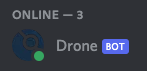
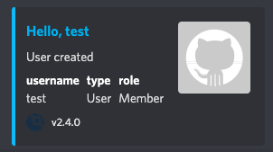
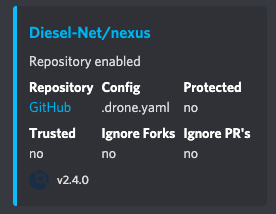
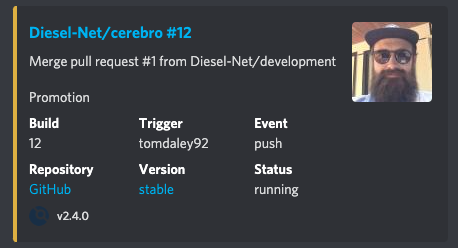
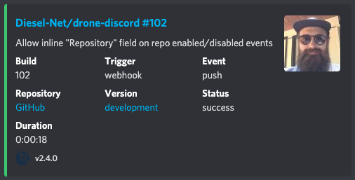
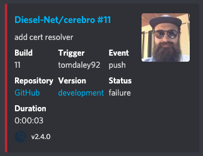

[](https://drone.kiwi-labs.net/Diesel-Net/drone-discord)


# drone-discord

#### **Summary**
&nbsp;&nbsp;&nbsp;&nbsp;&nbsp;A solution for posting [Drone](https://github.com/harness/drone)'s build logs to Discord. 
This could easily be modified to support other communications platforms, like Slack.

#### **Why?**
&nbsp;&nbsp;&nbsp;&nbsp;&nbsp;A drone server [can optionally be configured](https://discourse.drone.io/t/how-to-use-global-webhooks/3755) to post all of it's events to an HTTP endoint of your choosing. I figured this was a good opportunity for me to learn more about Discord's APIs as well.

#### **Components**
&nbsp;&nbsp;&nbsp;&nbsp;&nbsp;The core (and only necessary) component that does all the work, is a tiny Rest API (Flask App) for receiving the webhook events from the configured Drone Server. Once the payload is received and verified, Discord's REST API is then used to log the events nicely in the configured channel.

&nbsp;&nbsp;&nbsp;&nbsp;&nbsp;The other (optional) component contains some minimal code hacked together with the sole purpose of connecting to the Gateway (WebSocket) API for being able to accurately reflect the bot user's _Online_ status. This client process periodically checks-in on the Rest API to make sure it's healthy and adjusts the bot user's online presence accordingly.
It might be worth pointing out that this service is currently leveraging [`discord.py`](https://github.com/Rapptz/discord.py) which is [no longer being maintained](https://gist.github.com/Rapptz/4a2f62751b9600a31a0d3c78100287f1), however I am confident that this will still work for quite some time until Discord's Gateway API changes dramatically, for any reason. Thus an area of improvement could be to rewrite that piece by implementing a lightweight Discord Websocket client from scratch, having only the features and reconnect logic that it needs.

## Features
* [x] Supports all [Drone events](https://discourse.drone.io/t/how-to-use-global-webhooks/3755)
* [x] Verifies [HTTP Signatures](https://datatracker.ietf.org/doc/html/draft-cavage-http-signatures-10)
* [x] API/Docker Healthchecks
  * [x] Adjusts bot user's online/offline status accordingly
* [x] No configuration required in any `.drone.yml` pipeline files

## Screenshots













## Implementation Notes

- Server (REST API)
  - Trigger off of [drone events](https://discourse.drone.io/t/how-to-use-global-webhooks/3755) sent directly to my bot (over LAN)
  - Uses [`Flask`](https://github.com/pallets/flask) microframework
  - Uses [`Gunicorn`](https://github.com/benoitc/gunicorn) as a production-ready webserver in front of flask
    - Webhook receiving endoint
      - HTTP POST
      - Verifies [HTTP Signatures](https://datatracker.ietf.org/doc/html/draft-cavage-http-signatures-10) from Drone
      - Configured to post drone events in a specific discord channel
    - Healthcheck endpoint
      - HTTP GET
      - Used by both docker and the client service
  - Data persistence
    - Uses [MongoDB](https://github.com/mongodb/mongo) as persistent datastore for gunicorn workers
    - Drone events states?
    - Discord message ID's
    - Use [`PyMongo`](https://pymongo.readthedocs.io/en/stable/) to talk to MongoDB instance
  - Configuration
    - Discord bot token
    - Discord channel
    - Webhook endoint
    - Healthcheck endpoint
    - MongoDB
    - Gunicorn (docker only)

- Client (Websocket Connection)
  - Use [`discord.py`](https://github.com/Rapptz/discord.py)
    - Leverages [hearbeating](https://discord.com/developers/docs/topics/gateway#heartbeating) to display online/offline status
  - Periodically checks if HTTP Server is healthy
    - Sets the bot user to offline in Discord if no 200 Ok response
  - Configuration
    - Discord bot token
    - Healthcheck URL


## Toolchain
- Python 3.9.7
- Ansible 4.6.0
- Ansible-Core 2.11.5
- Docker-Engine 20.10.8
- Docker-CLI 20.10.8


## Deployments
&nbsp;&nbsp;&nbsp;&nbsp;&nbsp;Deployed on docker swarm, and automated with Drone and Ansible.
A convenience script is provided to invoke the ansible playbook manually if needed. You will need to ensure a proper SSH configuration and have a [default Ansible vault password set](https://docs.ansible.com/ansible/latest/user_guide/vault.html#setting-a-default-password-source). Please see [deploy.sh](deploy.sh) for hints.
```bash
source deploy.sh
```


## Run it Locally
&nbsp;&nbsp;&nbsp;&nbsp;&nbsp;You will need a valid `.env` containing the necessary key/value pairs for configuration. This file should be added to .gitignore to prevent accidentally committing any secrets. Please read more about [`python-dotenv`](https://github.com/theskumar/python-dotenv) if you are unfamiliar with the syntax. 

```bash
# .env
DRONE_WEBHOOK_SECRET=webhook-secret
DISCORD_TOKEN=secret-token
DISCORD_CHANNEL_ID=873357168118755348
HEALTHCHECK_INTERVAL=10
HEALTHCHECK_URL=http://localhost:5000/health

MONGO_DATABASE=drone-discord
MONGO_HOST=localhost
MONGO_PORT=27017
MONGO_INITDB_ROOT_USERNAME=root
MONGO_INITDB_ROOT_PASSWORD=secret-password
```

&nbsp;&nbsp;&nbsp;&nbsp;&nbsp;Each component listed below needs to executed in it's own terminal window, as they are all started with a blocking call.

#### MongoDB
1. Create Python Virtual Environment and activate it.
   ```bash
   python3 -m venv mongo-venv && source mongo-venv/bin/activate
   ```

2. install python dependencies.
   ```bash
   pip install "python-dotenv[cli]"
   ````

2. Start MongoDB container.
   
   :warning: The `docker run` command is not able to see env vars passed in with the `-p` option so if going with a non-default configuration you will need to adjust the port numbers manually in the command below.
   ```bash
   dotenv run \
     docker run \
      -p 27017:27017 \
      -e MONGO_INITDB_ROOT_USERNAME \
      -e MONGO_INITDB_ROOT_PASSWORD \
      mongo
   ```

#### HTTP Server
1. Create Python Virtual Environment and activate it.
   ```bash
   python3 -m venv server-venv && source server-venv/bin/activate
   ```

2. Install python depenencies
   ```bash
   pip install -r server-requirements.txt
   ```

3. Start Flask Development Server. A MongoDB instance should be running.
   ```bash
   flask run
   ```

   You may choose to reset the development database at any time. A MongoDB must be running.
   ```bash
   flask init-db
   ````


#### Websocket Client
1. Create Python Virtual Environment and activate it
   ```bash
   python3 -m venv client-venv && source client-venv/bin/activate
   ```

2. Install python depenencies
   ```bash
   pip install -r client-requirements.txt
   ```

3. Start Discord client.
   ```bash
   python client.py
   ```

#### Drone Events
&nbsp;&nbsp;&nbsp;&nbsp;&nbsp;There should be a collection of sample curls in the `test` folder in this repository. These are useful for simulating drone events when running locally.

:warning: All of these test curls have been signed using a webhook secret value of `webhook-secret` just as shown in the `.env` example configuration above.  
```bash
# user events
source test/user_created.sh
source test/user_deleted.sh

# repo events
source test/repo_enabled.sh
source test/repo_disabled.sh

# build events
source test/build_created.sh
source test/build_updated.sh
source test/build_killed.sh
source test/build_failure.sh
source test/build_success.sh
```
